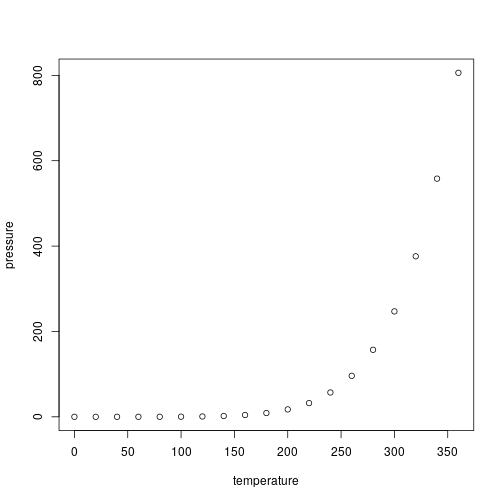

<!-- README.md is generated from README.Rmd. Please edit that file -->


# pmbbPheWASr

<!-- badges: start -->
[](https://github.com/mglev1n/pmbbPheWASr/actions/workflows/R-CMD-check.yaml)
[](https://app.codecov.io/gh/mglev1n/pmbbPheWASr?branch=main)
<!-- badges: end -->

The goal of pmbbPheWASr is to ...

## Installation

You can install the development version of pmbbPheWASr from [GitHub](https://github.com/) with:

``` r
# install.packages("devtools")
devtools::install_github("mglev1n/pmbbPheWASr")
```

## Documentation

Full documentation website on: https://mglev1n.github.io/pmbbPheWASr

## Example

This is a basic example which shows you how to solve a common problem:


```r
library(pmbbPheWASr)
#> Error in library(pmbbPheWASr): there is no package called 'pmbbPheWASr'
## basic example code
```

What is special about using `README.Rmd` instead of just `README.md`? You can include R chunks like so:


```r
summary(cars)
#>      speed           dist       
#>  Min.   : 4.0   Min.   :  2.00  
#>  1st Qu.:12.0   1st Qu.: 26.00  
#>  Median :15.0   Median : 36.00  
#>  Mean   :15.4   Mean   : 42.98  
#>  3rd Qu.:19.0   3rd Qu.: 56.00  
#>  Max.   :25.0   Max.   :120.00
```

You'll still need to render `README.Rmd` regularly, to keep `README.md` up-to-date. `devtools::build_readme()` is handy for this.

You can also embed plots, for example:

<div class="figure">

<p class="caption">plot of chunk pressure</p>
</div>

In that case, don't forget to commit and push the resulting figure files, so they display on GitHub and CRAN.
